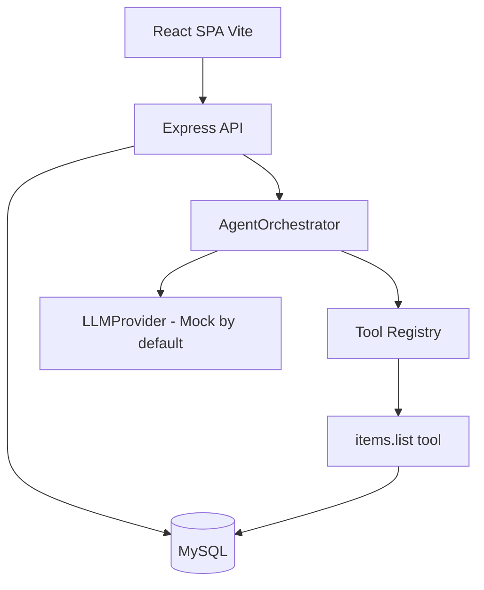

# Fullstack MySQL + Node.js + Express + React + Agent Orchestrator Template

A ready-to-run template to jumpstart projects built on:

- **MySQL 8** (via Docker or local install)
- **Node.js + Express** REST API
- **Sequelize** ORM with three-table auth model (`user_profile`, `user_login`, `user_account`) plus a CRUD demo (`items`)
- **JWT** authentication (register / login / me + protected routes)
- **Agent Orchestrator** - a provider-agnostic skeleton with a pluggable `BaseProvider`, a `MockProvider` for offline use, and a tool registry
- **React (Vite) + React Router + Axios** SPA with Login, Register, Dashboard, Items CRUD, and Agent chat pages

---

## 1. Architecture



- Frontend talks only to the Express API over HTTP/JSON.
- Every protected route requires `Authorization: Bearer <jwt>`.
- The Agent Orchestrator is called via `POST /api/agent/chat`. It loops: ask provider -> execute tool calls -> ask again -> return final message plus a full trace.

---

## 2. Repository layout

```
.
|-- docker-compose.yml        # MySQL 8 for local dev
|-- .gitignore
|-- README.md
|-- backend/
|   |-- package.json
|   |-- .env.example
|   `-- src/
|       |-- server.js          # bootstrap: sequelize.authenticate + sync + listen
|       |-- app.js             # express app, cors, routes, error handler
|       |-- config/db.js       # Sequelize instance from env
|       |-- models/            # UserProfile, UserLogin, UserAccount, Item + associations
|       |-- middleware/        # authMiddleware (JWT), errorHandler
|       |-- utils/             # jwt.js, password.js (bcryptjs)
|       |-- services/          # authService, itemService (business logic)
|       |-- controllers/       # thin HTTP layer
|       |-- routes/            # /api/auth, /api/users, /api/items, /api/agent
|       `-- agent/
|           |-- orchestrator.js
|           |-- providers/     # BaseProvider, MockProvider
|           `-- tools/         # itemsTool and registry
`-- frontend/
    |-- package.json           # react, react-router-dom, axios, vite
    |-- vite.config.js
    |-- index.html
    |-- .env.example
    `-- src/
        |-- main.jsx
        |-- App.jsx            # routes + auth gates
        |-- api/               # axios client with JWT interceptor + per-resource clients
        |-- context/           # AuthContext (token + user + login/register/logout)
        |-- components/        # Navbar, ProtectedRoute
        |-- pages/             # Login, Register, Dashboard, Items, Agent
        `-- styles/index.css
```

---

## 3. Prerequisites

- Node.js >= 18
- npm (or pnpm/yarn)
- MySQL 8 running locally, or Docker Desktop for the bundled `docker-compose.yml`

---

## 4. Quick start

### 4.1. Start MySQL

Using Docker:

```powershell
docker compose up -d mysql
```

Or use any MySQL 8 instance and adjust `backend/.env`.

### 4.2. Backend

```powershell
cd backend
copy .env.example .env
npm install
npm run dev
```

The server boots on `http://localhost:4000`. On first start, `sequelize.sync({ alter: true })` creates all tables automatically.

### 4.3. Frontend

```powershell
cd frontend
copy .env.example .env
npm install
npm run dev
```

Open `http://localhost:5173` and register your first user.

---

## 5. Environment variables

### backend/.env

| Variable | Default | Notes |
|---|---|---|
| `PORT` | `4000` | API port |
| `NODE_ENV` | `development` | Toggles SQL logging and stack traces in errors |
| `CORS_ORIGIN` | `http://localhost:5173` | Must match the frontend origin |
| `DB_HOST` / `DB_PORT` | `127.0.0.1` / `3306` | MySQL host/port |
| `DB_USER` / `DB_PASSWORD` / `DB_NAME` | `app_user` / `app_password` / `app_db` | Matches `docker-compose.yml` |
| `JWT_SECRET` | - | **Required.** Use a long random string |
| `JWT_EXPIRES_IN` | `1d` | Any `jsonwebtoken` duration string |
| `AGENT_PROVIDER` | `mock` | Selects which provider `buildDefaultProvider()` uses |

### frontend/.env

| Variable | Default |
|---|---|
| `VITE_API_BASE_URL` | `http://localhost:4000/api` |

---

## 6. API reference

All JSON unless noted. Protected endpoints require `Authorization: Bearer <jwt>`.

| Method | Path | Auth | Body | Purpose |
|---|---|---|---|---|
| GET | `/health` | no | - | Liveness probe |
| POST | `/api/auth/register` | no | `{ fullName, email, username, password }` | Creates profile + login + account in one transaction, returns `{ token, user }` |
| POST | `/api/auth/login` | no | `{ username, password }` | Returns `{ token, user }` and updates `last_login_at` |
| GET | `/api/auth/me` | yes | - | Returns the authenticated `user` with nested `login` and `account` |
| GET | `/api/users` | yes | - | Demo listing of users (guard with role in prod) |
| GET | `/api/items` | yes | - | Owner-scoped item list |
| POST | `/api/items` | yes | `{ name, description? }` | Create item |
| GET | `/api/items/:id` | yes | - | Fetch one item (owner-only) |
| PUT | `/api/items/:id` | yes | `{ name?, description? }` | Update item |
| DELETE | `/api/items/:id` | yes | - | Delete item |
| POST | `/api/agent/chat` | yes | `{ message, history? }` | Run the orchestrator; returns `{ message, trace, messages }` |

---

## 7. Auth model (three tables)

Splitting auth across three tables keeps concerns separated and easy to extend.

- **`user_profile`** - identity (full name, email, avatar). One row per human.
- **`user_login`** - credentials (username, `password_hash`, `last_login_at`, `failed_attempts`). Swap this out if you move to OAuth/SSO without touching profile data.
- **`user_account`** - authorization state (`status`, `role`, `plan`). Good home for billing/feature-flag fields.

Registration creates all three rows inside a single Sequelize transaction (`backend/src/services/authService.js`). The JWT only embeds `sub` (profile id) and `username`; the middleware attaches `req.user = { profileId, username }` on every protected request.

---

## 8. CRUD demo (`items`)

The `items` table is owned by `user_profile` via `user_profile_id`. Every query in `itemService.js` scopes by the authenticated profile id, so ownership is enforced at the service layer. Use it as the blueprint for your own resources - copy `itemService.js`, `itemController.js`, `itemRoutes.js`, and register the router in `routes/index.js`.

---

## 9. Agent Orchestrator

### Contract

Every provider implements one method:

```js
// backend/src/agent/providers/BaseProvider.js
async chat({ messages, tools }) {
  // returns: { content: string, toolCalls: [{ name, arguments? }, ...] }
}
```

The orchestrator (`backend/src/agent/orchestrator.js`) runs this loop:

1. Call `provider.chat({ messages, tools })`.
2. If `toolCalls` is empty, push the final assistant message and return `{ message, trace, messages }`.
3. Otherwise, execute each tool from the registry, append `{ role: 'tool', name, content: JSON.stringify(result) }`, and iterate.
4. Stops after `maxIterations` (default 4) to avoid runaway loops.

### Plugging a real LLM

Create a new file under `backend/src/agent/providers/` that extends `BaseProvider`. Example skeleton for an OpenAI-compatible endpoint:

```js
const { BaseProvider } = require('./BaseProvider');

class OpenAIProvider extends BaseProvider {
  async chat({ messages, tools }) {
    // 1. Translate tools into your vendor's tool/function-calling schema
    // 2. POST to your LLM endpoint with messages + tools
    // 3. Map the response to { content, toolCalls }
    return { content: '...', toolCalls: [] };
  }
}

module.exports = { OpenAIProvider };
```

Then wire it in `buildDefaultProvider()` inside `orchestrator.js`:

```js
case 'openai': return new OpenAIProvider();
case 'huggingface': return new HuggingFaceProvider();
```

And set `AGENT_PROVIDER=openai` in `backend/.env`.

### Adding a new tool

1. Create `backend/src/agent/tools/myTool.js`:

```js
module.exports.myTool = {
  name: 'my.tool',
  description: 'What this tool does.',
  parameters: { type: 'object', properties: { /* JSON schema */ } },
  async handler(args, ctx) {
    // ctx.profileId and ctx.username are provided by the agent controller
    return { ok: true };
  },
};
```

2. Register it in `backend/src/agent/tools/index.js` by adding it to the `tools` array.

The `MockProvider` can be taught to request your tool for demos, or a real LLM will call it via its tool-calling mechanism.

---

## 10. Folder-by-folder tour (backend)

- **`config/db.js`** - Sequelize connection, reads `DB_*` env vars.
- **`models/*`** - one file per table; `models/index.js` wires associations.
- **`utils/jwt.js` / `utils/password.js`** - thin wrappers over `jsonwebtoken` and `bcryptjs`.
- **`middleware/authMiddleware.js`** - verifies `Authorization: Bearer` header.
- **`middleware/errorHandler.js`** - unified JSON error response.
- **`services/*`** - business logic; throw `HttpError(status, message)` for controlled failures.
- **`controllers/*`** - Express handlers. Keep them thin; delegate to services.
- **`routes/*`** - route tables. `routes/index.js` composes the `/api/*` mount points.
- **`agent/*`** - orchestrator, providers, tools.

## 11. Folder-by-folder tour (frontend)

- **`api/client.js`** - shared Axios instance; injects JWT and redirects on 401.
- **`api/{auth,items,agent}.js`** - per-resource API helpers.
- **`context/AuthContext.jsx`** - token/user state, persists token to `localStorage`.
- **`components/ProtectedRoute.jsx`** - redirects to `/login` when no token.
- **`components/Navbar.jsx`** - top nav and logout.
- **`pages/*`** - one file per route.
- **`styles/index.css`** - minimal, dependency-free styling.

---

## 12. Recommended next steps

- Replace `sequelize.sync({ alter: true })` with real migrations (`sequelize-cli` or `umzug`).
- Add refresh tokens / httpOnly cookie storage for production auth.
- Add role-based guards (`req.user.role === 'admin'`) on admin endpoints.
- Add input validation (`zod`, `joi`, or `express-validator`).
- Add tests (`vitest` for frontend, `jest` or `node --test` for backend).
- Containerize the backend/frontend and extend `docker-compose.yml` for production.
- Implement a real `LLMProvider` (OpenAI-compatible, Hugging Face Inference API, local Ollama, etc.).

Happy building.
# tmp_node_react_mysql_agent

